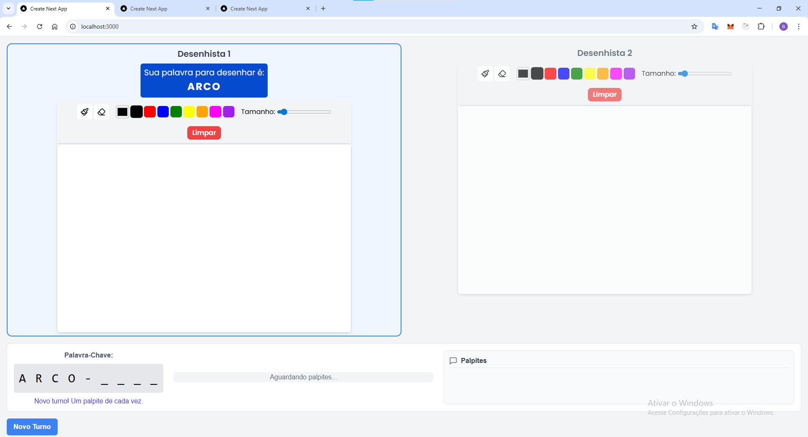

# Rabisco

 **Rabisco** é um jogo multiplayer online de desenho e adivinhação em tempo real, desenvolvido como um projeto de aplicação da matéria Redes de Computadores. Ele é inspirado no clássico Gartic, com o diferencial de que a palavra-chave a ser adivinhada é composta, e dois jogadores desenham cada parte dela simultaneamente.

## ✨ Funcionalidades

* **Jogabilidade em Tempo Real:** Desenhe e adivinhe com baixa latência graças à comunicação via WebSockets.
* **Palavras Compostas:** Desafie seus amigos com palavras como "GUARDA-CHUVA" ou "PÃO DE QUEIJO", onde cada parte é desenhada por um jogador diferente.
* **Salas Multiplayer:** Crie ou junte-se a salas para jogar com seus amigos.
* **Interface Simples:** Uma interface limpa e intuitiva para focar na diversão.

## 🛠️ Tecnologias Utilizadas

O projeto é dividido em duas partes principais: o frontend e o backend (servidor WebSocket).

* **Frontend:**
    * [Next.js](https://nextjs.org/) (React Framework)
    * [TypeScript](https://www.typescriptlang.org/)
    * CSS Modules
* **Backend (Servidor WebSocket):**
    * [Node.js](https://nodejs.org/)
    * Biblioteca [ws](https://github.com/websockets/ws) para o servidor WebSocket
* **Utilitários:**
    * `npm-run-all` para executar os servidores de frontend e backend simultaneamente.

## 🚀 Como Executar o Projeto

Siga os passos abaixo para rodar o projeto em seu ambiente local.

### Pré-requisitos

* [Node.js](https://nodejs.org/en/) (versão 18.18.0 ou superior)
* npm ou yarn

### Instalação

1.  Clone o repositório:
    ```bash
    git clone [https://github.com/seu-usuario/gartic-2.git](https://github.com/seu-usuario/gartic-2.git)
    ```

2.  Navegue até a pasta do frontend:
    ```bash
    cd gartic-2/frontend
    ```

3.  Instale as dependências do projeto:
    ```bash
    npm install
    ```

### Execução

Para iniciar o projeto, execute o seguinte comando na pasta `frontend`:

```bash
npm run dev
```

Este comando irá iniciar:
* O servidor Next.js (frontend) em `http://localhost:3000`.
* O servidor WebSocket (backend) na porta `8001`.

Abra [http://localhost:3000](http://localhost:3000) em seu navegador para começar a jogar.

### Testando o Multiplayer com VPN

Para testar o jogo com amigos em computadores diferentes na mesma rede (sem fazer o deploy para um servidor público), utilizamos uma VPN.

1.  **Configure uma VPN:** Todos os jogadores devem se conectar à mesma rede VPN (ex: Hamachi, Radmin VPN).
2.  **Identifique o IP do Host:** O jogador que estiver rodando o servidor (com `npm run dev`) deve descobrir seu endereço de IP na rede da VPN.
3.  **Altere o Código:** No arquivo `frontend/app/context/SocketContext.tsx`, altere o endereço do WebSocket para o IP do host na VPN.
    ```javascript
    // Exemplo
    const ws = new WebSocket("ws://SEU.IP.NA.VPN:8001");
    ```
4.  **Execute e Jogue:** Todos os outros jogadores devem acessar o site pelo IP do host (ex: `http://SEU.IP.NA.VPN:3000`).

## 룰 Como Jogar

1.  Após iniciar o servidor, cada jogador abre o link no navegador.
2.  Escolha um nome/papel e digite o mesmo ID de sala para todos os jogadores.
3.  Clique em "Entrar na Sala".
4.  Qualquer jogador pode clicar em "Novo Turno" para começar.
5.  Dois jogadores serão designados como desenhistas e receberão uma parte da palavra para desenhar. Os outros serão os adivinhos.
6.  Adivinhe a palavra completa no chat!

---
